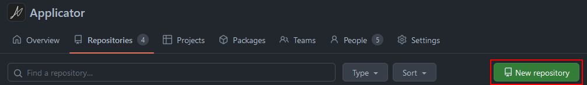
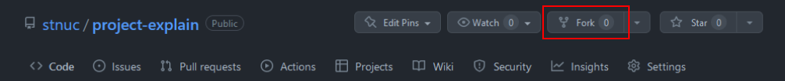

Languages 

[한국어](./KO_README.md) | [English](./README.md)

# Welcome to Project
프로젝트 진행방법에 대한 설명입니다  

두가지 방법으로 진행할 수 있습니다  
1. Owner를 Applicator에 두고, fork하여 작업하는 방법  
2. 자신의 repo를 만들고, Applicator에 링크만 남기는 방법  
 

## 1. Create repo at Applicator
새 리포지토리를 만듭니다 (Owner at Applicator)  

개인 리포지토리에 fork합니다 (After initial commit)  

개인 리포지토리에서 작업 후, 주기적으로 메인 리포지토리에 pull request합니다 (메이저 업데이트, 프로젝트 마무리 등)  
 

## 2. Create repo at your own repository
Applicator에 새 리포지토리를 만듭니다  
README.md 파일을 만들고, 프로젝트 설명과 함께 링크를 걸어둡니다  